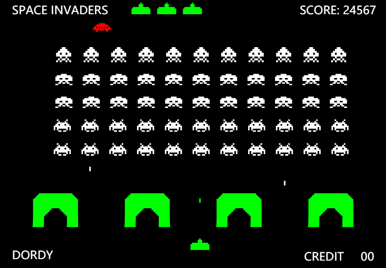
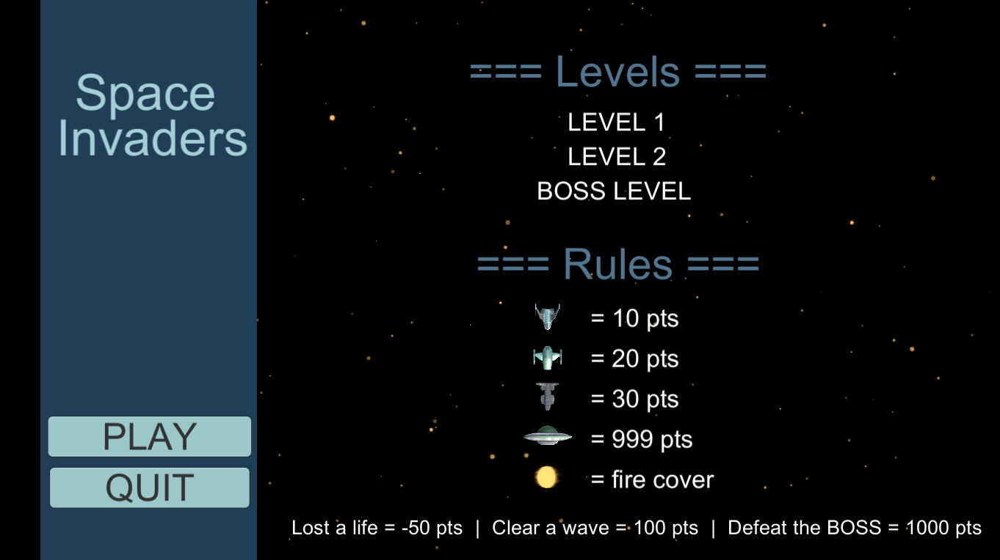
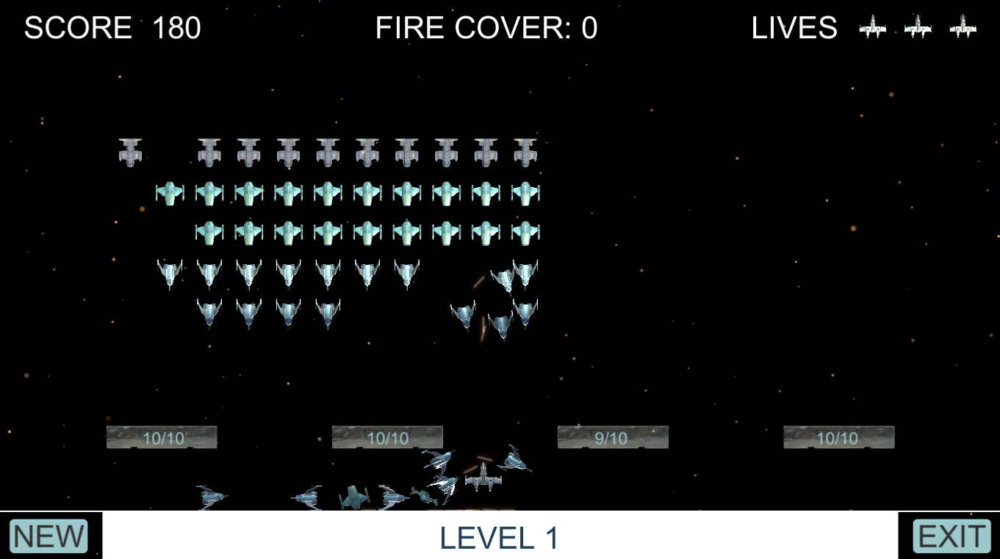
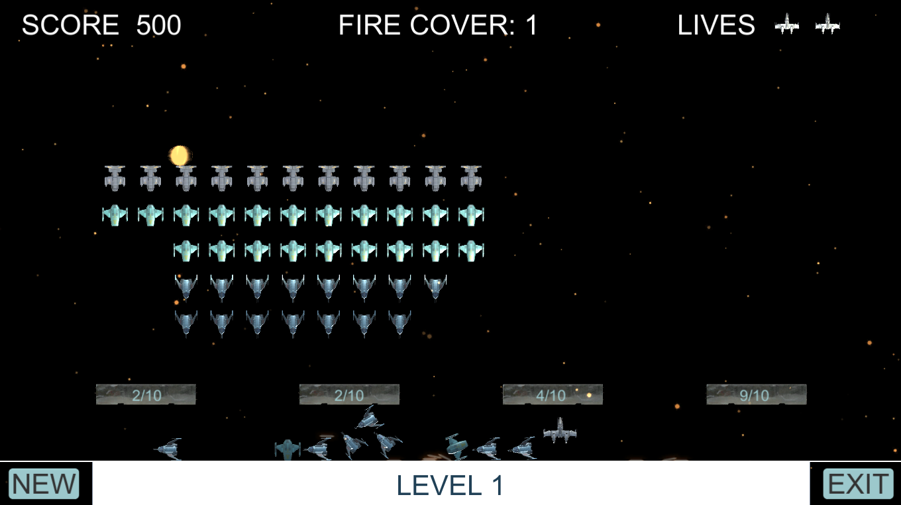
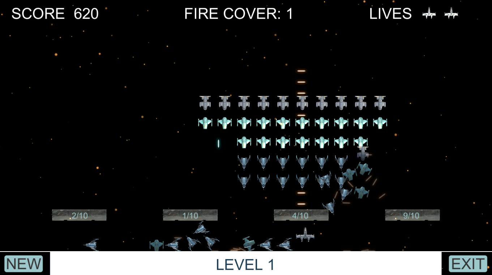
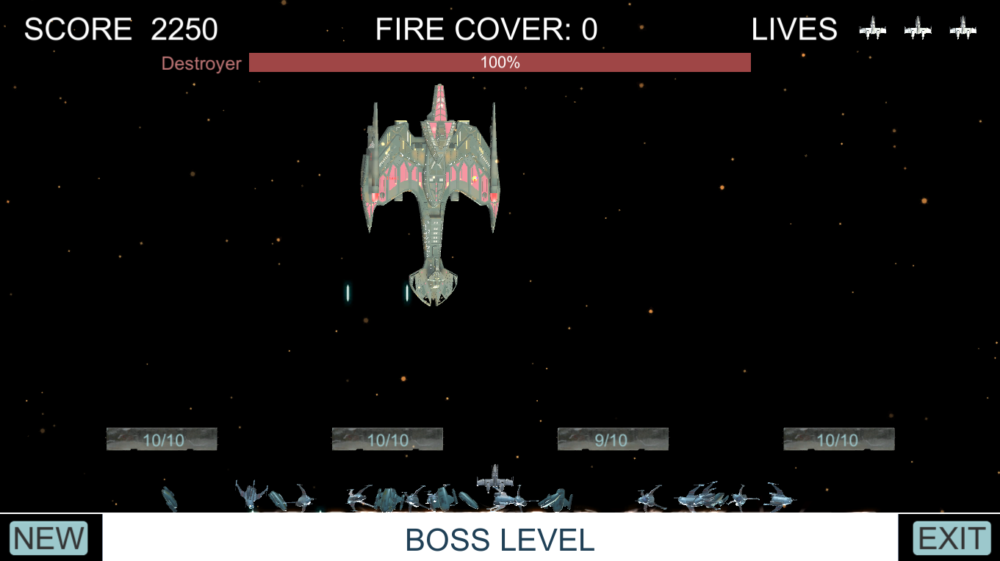

CIS568-SpaceInvader
========================

**University of Pennsylvania, CIS 568: Game Design Practicum, Project 1**

* Yalun Hu

  

# Features

## 1. Scoring System

  

## 2. Rigid Body Physics

  

Add rigid body physics to the Space Invader ships and Player ship:
ships fall to the ground after being shot, player ship can clear debris on the ground when moving left and right, etc.

Create physically-based Space Invader bullets and Player bullets that accumulate on the ground after being fired.

## 3. “Fire Cover” resource

* Generate Fire Cover:

  

* Use Fire Cover:

  

 The “Fire Cover” is randomly generated at the top of the scene in the battle, and it will fall from the top to the bottom of the screen. The player can pick up the “Fire Cover” and press “R” to shoot it. Shooting a “Fire Cover” will generate several bullets moving horizontally from the right to the left of the screen.

## 4. Boss Level

  

The game will level up after the player clears one wave. The boss battle is after LEVEL2. The boss will move horizontally and randomly, and it shoots two bullets each time.

# References
* [Unity Space Shooter tutorial](https://unity3d.com/cn/learn/tutorials/s/space-shooter-tutorial)
* [Unity Official Documentation](https://docs.unity3d.com/ScriptReference/index.html)
